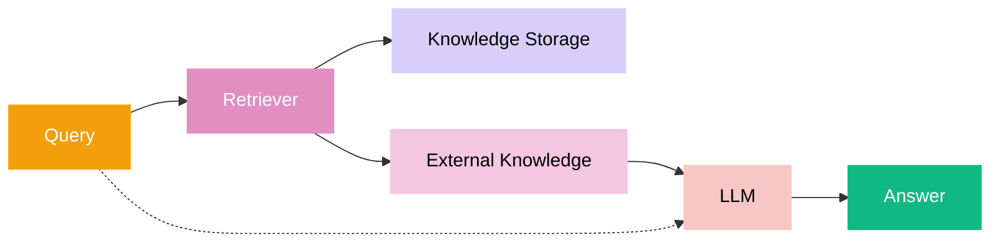

# Naive RAG

## Architecture



## Running

### Eng
```bash
python -m src.modules.01_intro.naive_rag.app --lang eng --query "Why can't rescuers approach the seven young Qi-Lir who fell into catatonia in the abandoned mine?"
```

> Expected answer:
> Because the walls were polished with basalt dust to a mirror shine, and anyone who approaches risks secondary reflection — that is, also seeing "the Void Within" and falling catatonic.

### Ru
```bash
python -m src.modules.01_intro.naive_rag.app --lang ru --query "Почему спасатели не могут приблизиться к семи молодым Ки-Лир, впавшим в кататонию в заброшенной шахте?"
```
> Ожидаемый ответ:
> Потому что стены шахты были натёрты базальтовой пылью до зеркального блеска, и любой, кто приблизится, рискует вторичным отражением — то есть тоже увидит «Пустоту внутри» и впадёт в кататонию.
