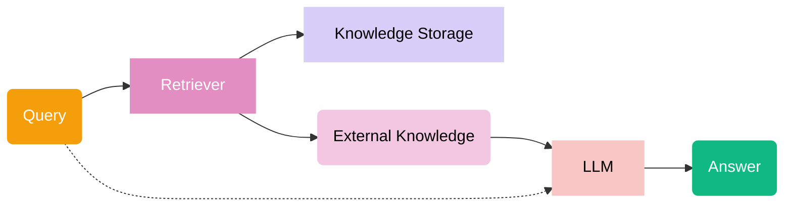

# Naive RAG

## Architecture



## Running

```bash
python -m src.modules.first_rag.app -n 3 -k 2 --query "Почему спасатели не могут приблизиться к семи молодым Ки-Лир, впавшим в кататонию в заброшенной шахте?"
```
> Ожидаемый ответ:
> Потому что стены шахты были натёрты базальтовой пылью до зеркального блеска, и любой, кто приблизится, рискует вторичным отражением — то есть тоже увидит «Пустоту внутри» и впадёт в кататонию.


## Retrieval evaluation

```bash
python -m src.modules.first_rag.eval -n 3 -k 2
```

```plain
===== FINAL RESULTS =====
N queries: 25
Hit Rate@2: 1.00
```