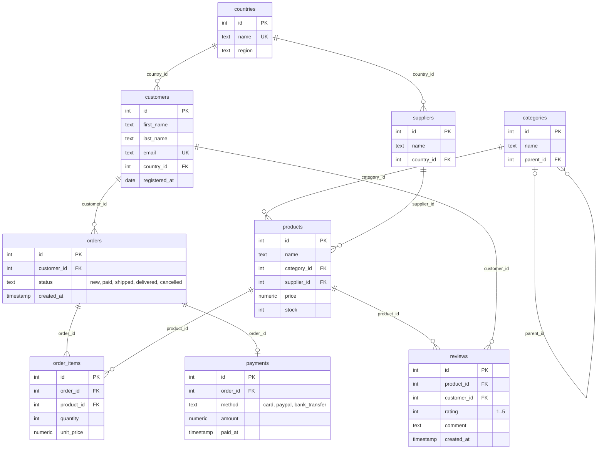

# Схема базы данных (интернет-магазин)

Создаётся скриптом [init_database.py](init_database.py).

```mermaid
erDiagram
    countries {
        int id PK
        text name UK
        text region
    }
    customers {
        int id PK
        text first_name
        text last_name
        text email UK
        int country_id FK
        date registered_at
    }
    categories {
        int id PK
        text name
        int parent_id FK
    }
    suppliers {
        int id PK
        text name
        int country_id FK
    }
    products {
        int id PK
        text name
        int category_id FK
        int supplier_id FK
        numeric price
        int stock
    }
    orders {
        int id PK
        int customer_id FK
        text status "new, paid, shipped, delivered, cancelled"
        timestamp created_at
    }
    order_items {
        int id PK
        int order_id FK
        int product_id FK
        int quantity
        numeric unit_price
    }
    payments {
        int id PK
        int order_id FK
        text method "card, paypal, bank_transfer"
        numeric amount
        timestamp paid_at
    }
    reviews {
        int id PK
        int product_id FK
        int customer_id FK
        int rating "1..5"
        text comment
        timestamp created_at
    }

    countries ||--o{ customers : "country_id"
    countries ||--o{ suppliers : "country_id"
    categories |o--o{ categories : "parent_id"
    categories ||--o{ products : "category_id"
    suppliers ||--o{ products : "supplier_id"
    customers ||--o{ orders : "customer_id"
    orders ||--|{ order_items : "order_id"
    products ||--o{ order_items : "product_id"
    orders ||--o| payments : "order_id"
    products ||--o{ reviews : "product_id"
    customers ||--o{ reviews : "customer_id"
```
