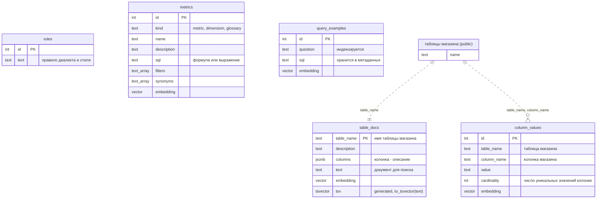

# Схема семантического слоя

```mermaid
erDiagram
    rules {
        int id PK
        text text "правило диалекта и стиля"
    }
    table_docs {
        text table_name PK "имя таблицы магазина"
        text description
        jsonb columns "колонка - описание"
        text text "документ для поиска"
        vector embedding
        tsvector tsv "generated, to_tsvector(text)"
    }
    metrics {
        int id PK
        text kind "metric, dimension, glossary"
        text name
        text description
        text sql "формула или выражение"
        text_array filters
        text_array synonyms
        vector embedding
    }
    query_examples {
        int id PK
        text question "индексируется"
        text sql "хранится в метаданных"
        vector embedding
    }
    column_values {
        int id PK
        text table_name "таблица магазина"
        text column_name "колонка магазина"
        text value
        int cardinality "число уникальных значений колонки"
        vector embedding
    }
    shop_tables["таблицы магазина (public)"] {
        text name
    }

    shop_tables ||..|| table_docs : "table_name"
    shop_tables ||..o{ column_values : "table_name, column_name"
```
