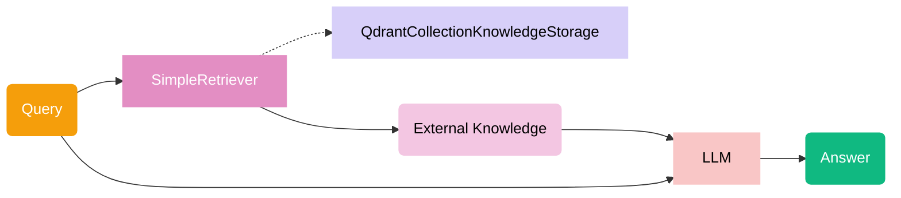

# Canonical RAG

## Architecture




## Running

```bash
python -m src.modules.vector_search.canonical_rag.run
```
> Ожидаемый ответ:
> The Berry Export Summary 2028 is a dedicated export plan for the Australian strawberry, raspberry, and blackberry industries. It maps the sectors’ current position, where they want to be, high-opportunity markets, and next steps. The purpose of this plan is to grow their global presence over the next 10 years.
